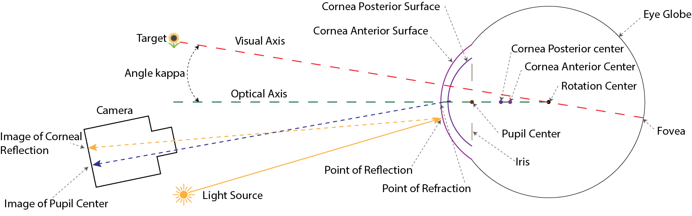
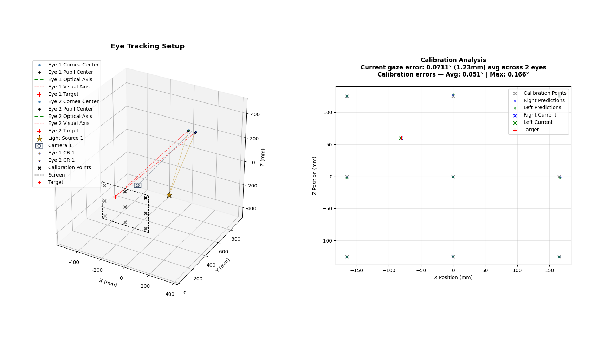

PyEtSimul Documentation
=======================

**PyEtSimul** is an open-source Python framework for simulating video-based eye trackers
by generating synthetic eye features through geometric modeling. The framework allows
flexible positioning of eyes, cameras, and light sources in 3D space, with controlled
variation of eye anatomical features and camera properties.

|

PyEtSimul's core code is based on `et_simul <https://github.com/mh-salari/et_simul-1.01>`_ [1],
but extends it by generalizing corneal modeling to conic surfaces rather than the common sphere,
supporting non-circular pupil shapes, size-dependent pupil decentration, eyelid occlusion,
and camera lens distortion. It also supports systematic data generation and principled comparison
of gaze estimation algorithms across calibrated and uncalibrated settings.

By generating fully synthetic data, PyEtSimul removes privacy concerns and the need for
costly hardware, making it practical for both educational and research applications.

.. toctree::
   :maxdepth: 2
   :caption: Contents

   getting_started

.. toctree::
   :maxdepth: 2
   :caption: Theory

   theory/eye_model
   theory/optical_calculations
   theory/camera_and_lights
   theory/gaze_estimation_models
   theory/evaluation_workflow
   theory/default_parameters

.. toctree::
   :maxdepth: 2
   :caption: Guides

   guides/custom_gaze_model
   guides/custom_variations

.. toctree::
   :maxdepth: 2
   :caption: API Reference

   api/index

----

.. note::

   The theoretical content in this documentation is derived from the PyEtSimul paper [2]
   by the same authors. If you use PyEtSimul in your research, please cite [2].

| [1] Bohme, M., Dorr, M., Graw, M., Martinetz, T., & Barth, E. (2008). A software framework for simulating eye trackers. In *Proceedings of the 2008 Symposium on Eye Tracking Research & Applications (ETRA '08)*, pp. 251-258. ACM. `DOI: 10.1145/1344471.1344529 <https://doi.org/10.1145/1344471.1344529>`_
| [2] Salari, M., Niehorster, D. C., Hansen, D. W., & Bednarik, R. (2026). PyEtSimul: An Open-Source Python Framework for Eye-Tracking Simulation. *[Paper under review]*
